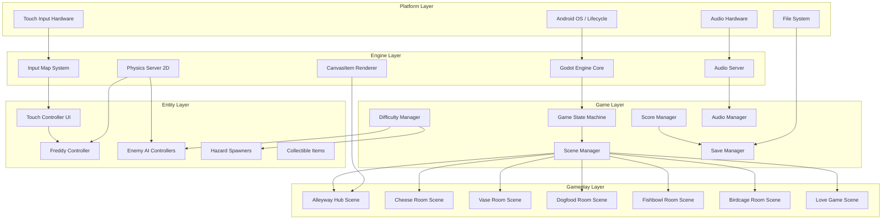
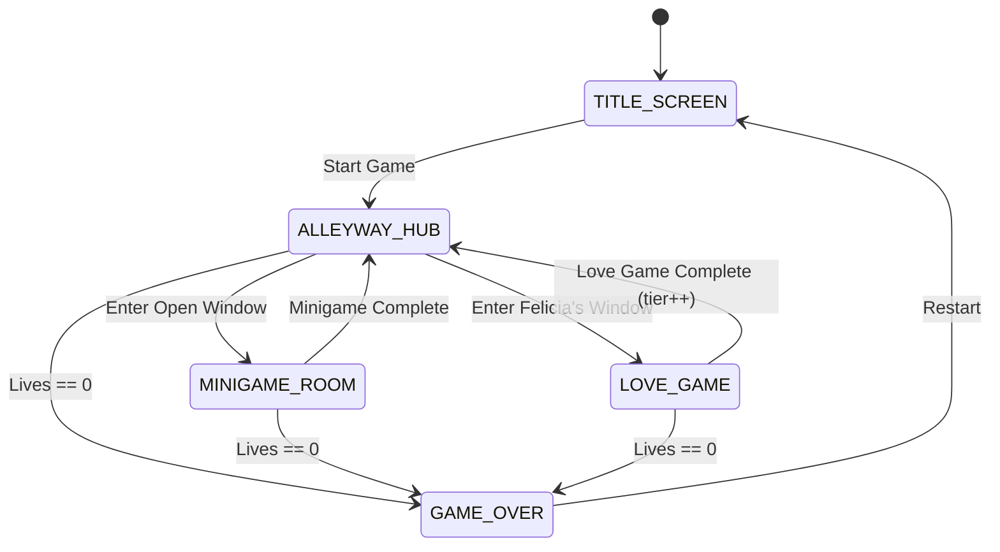
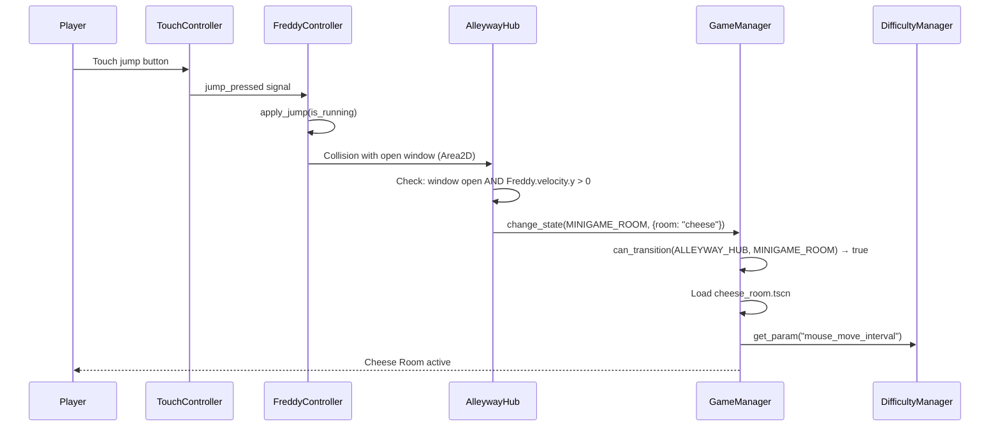

# Design Document: Alley Cat Android

## Overview

Alley Cat Android is a modern Android remake of the 1984 DOS classic "Alley Cat" by Bill Williams. The player controls Freddy the Cat navigating an alleyway hub, entering open windows to complete minigames, and ultimately reaching Felicia in the Love Game bonus stage. The game features five distinct minigame rooms, progressive difficulty scaling, touch-optimized controls, and modern pixel art with a vibrant palette inspired by the original CGA/PCjr graphics.

### Technology Choice: Godot 4.x

The architecture uses **Godot Engine 4.x** with GDScript as the game framework.

| Decision | Choice | Rationale |
|----------|--------|-----------|
| Engine | Godot 4.x | Lightweight APK, native Android export, built-in 2D physics, MIT license, scene-tree maps to game states |
| Language | GDScript | Fast iteration, tight engine integration, sufficient performance for 2D |
| Physics | Custom CharacterBody2D | Precise platformer feel requires hand-tuned movement parameters |
| Persistence | Godot FileAccess + JSON | Cross-platform, human-readable, no Android-specific API dependency |
| Rendering | Godot 2D CanvasItem renderer | Hardware-accelerated, supports viewports for responsive scaling |
| Audio | Godot AudioStreamPlayer/AudioBus | Built-in mixing, bus routing, stream pooling |

## Architecture

The system follows a layered architecture with clear separation between game flow control, gameplay logic, rendering, and platform services.



### Game State Machine Flow



### Scene Tree Structure

```
root
├── GameManager (autoload singleton)
├── ScoreManager (autoload singleton)
├── DifficultyManager (autoload singleton)
├── SaveManager (autoload singleton)
├── AudioManager (autoload singleton)
└── Main (Node2D)
    ├── CurrentScene (swapped by SceneManager)
    │   ├── TitleScreen / AlleywayHub / MinigameRoom / LoveGame / GameOver
    └── UILayer (CanvasLayer)
        ├── TouchController
        ├── HUD (score, lives, air meter)
        └── PauseMenu
```

## Components and Interfaces

### 1. Game State Machine (GameManager)

Manages top-level game flow transitions as an autoload singleton.

```gdscript
class_name GameManager extends Node

enum GameState { TITLE_SCREEN, ALLEYWAY_HUB, MINIGAME_ROOM, LOVE_GAME, GAME_OVER }

signal state_changed(old_state: GameState, new_state: GameState)
signal lives_changed(new_lives: int)

var current_state: GameState = GameState.TITLE_SCREEN
var lives: int = 9
var felicia_window_active: bool = false

func change_state(new_state: GameState, params: Dictionary = {}) -> void
func can_transition(from: GameState, to: GameState) -> bool
func lose_life() -> void
func gain_life() -> void
func reset_game() -> void
```

**Valid Transitions:**
- TITLE_SCREEN → ALLEYWAY_HUB
- ALLEYWAY_HUB → MINIGAME_ROOM
- ALLEYWAY_HUB → LOVE_GAME (only when felicia_window_active)
- MINIGAME_ROOM → ALLEYWAY_HUB
- LOVE_GAME → ALLEYWAY_HUB
- Any gameplay state → GAME_OVER (when lives == 0)
- GAME_OVER → TITLE_SCREEN

### 2. Touch Controller

Provides virtual input abstraction layer as a CanvasLayer overlay.

```gdscript
class_name TouchController extends CanvasLayer

signal move_input(direction: Vector2)
signal jump_pressed()
signal jump_released()
signal action_pressed()
signal action_released()

func set_action_button_visible(visible: bool) -> void
func get_movement_vector() -> Vector2
func is_jump_held() -> bool
func is_action_held() -> bool
```

**Layout:**
- Virtual joystick: left side, 80px max radius, 20px dead zone
- Jump button: right side lower, 60px radius
- Action button: right side upper, 50px radius (hidden when not needed)
- Input latency target: ≤16ms (processed in `_input()` callback)

### 3. Freddy Controller (Player Character)

CharacterBody2D with custom physics and animation state machine.

```gdscript
class_name FreddyController extends CharacterBody2D

enum AnimState { IDLE, WALKING, RUNNING, JUMPING, FALLING,
                 HANGING, CLIMBING, EATING, ELECTROCUTED, HURT }

signal died()

func apply_jump(is_running: bool) -> void
func apply_gravity(delta: float) -> void
func apply_swimming_physics(direction: Vector2, delta: float) -> void
func take_damage(source: String) -> void
func set_anim_state(state: AnimState) -> void
```

**Physics Parameters:**

| Parameter | Standing Jump | Running Jump |
|-----------|--------------|--------------|
| Jump Velocity Y | -450 px/s | -520 px/s |
| Horizontal Speed | 0–50 px/s | 200–350 px/s |
| Gravity | 980 px/s² | 980 px/s² |
| Max Fall Speed | 600 px/s | 600 px/s |

**Swimming Physics (Fishbowl Room):**
- Inertia model: `velocity += direction * acceleration * delta`
- Drag: `velocity *= (1.0 - drag * delta)`
- Max swim speed: 250 px/s
- Acceleration: 400 px/s²
- Drag coefficient: 3.0

### 4. Difficulty Manager

Singleton providing difficulty-scaled parameters across four tiers.

```gdscript
class_name DifficultyManager extends Node

enum Tier { KITTEN, HOUSE_CAT, TOMCAT, ALLEY_CAT }

var current_tier: Tier = Tier.KITTEN

func advance_tier() -> void  # Caps at ALLEY_CAT
func get_param(param_name: String) -> float
func reset() -> void
```

### 5. Score Manager

Tracks scoring, multipliers, and high score.

```gdscript
class_name ScoreManager extends Node

signal score_changed(new_score: int)
signal high_score_beaten(new_high: int)

var current_score: int = 0
var high_score: int = 0

func add_points(base_points: int, multiplier: float = 1.0) -> void
func calculate_time_bonus(time_remaining: float) -> int
func get_score() -> int
func get_high_score() -> int
func reset_score() -> void
```

### 6. Save Manager

Handles persistence to local JSON file.

```gdscript
class_name SaveManager extends Node

const SAVE_PATH = "user://alleycat_save.json"

func save_data(data: Dictionary) -> bool
func load_data() -> Dictionary  # Returns defaults on error
func save_high_score(score: int) -> void
func load_high_score() -> int
```

### 7. Audio Manager

Centralized audio playback with bus routing.

```gdscript
class_name AudioManager extends Node

func play_sfx(sfx_name: String) -> void
func play_music(track_name: String, crossfade: float = 0.5) -> void
func stop_music(fade_out: float = 0.5) -> void
func pause_all() -> void
func resume_all() -> void
```

**Audio Buses:** Master → Music, Master → SFX
**SFX Pool:** 8 AudioStreamPlayer nodes for concurrent playback

### 8. Enemy AI System

Abstract base for all enemy behaviors with specialized implementations.

```gdscript
class_name EnemyAI extends CharacterBody2D

func initialize(difficulty_params: Dictionary) -> void
func activate() -> void
func deactivate() -> void
func _ai_update(delta: float) -> void  # Override in subclasses
```

**Specialized AI Behaviors:**

| Enemy | Room | Algorithm |
|-------|------|-----------|
| Spider | Vase Room | Horizontal lerp toward Freddy's X; drops vertically when `|spider.x - freddy.x| < threshold` |
| Sleeping Dog | Dogfood Room | Awake meter: `rate = max_rate * (1.0 - distance / detection_radius)`; attacks when meter full |
| Electric Eel | Fishbowl Room | Constant velocity, reflect direction component on wall collision |
| Bird | Birdcage Room | `y = base_y + amplitude * sin(time * frequency)`, constant x velocity |
| Mouse | Cheese Room | Random pathfinding: pick random adjacent hole in grid, move along edge |
| Enemy Cat | Love Game | Horizontal lerp toward `freddy.x * tracking_accuracy`, clamped to row bounds |
| Dog | Alleyway Hub | Constant horizontal speed, reverse at screen edges |
| Magic Broom | Cheese/Birdcage | Sweeps horizontally, kills on contact |

### 9. Minigame Base Class

Abstract base scene for all five minigame rooms.

```gdscript
class_name MinigameBase extends Node2D

signal minigame_completed()
signal player_died()

var objective_count: int = 0
var objectives_completed: int = 0
var elapsed_time: float = 0.0

func _on_objective_achieved() -> void
func _on_player_hit(source: Node) -> void
func get_time_bonus() -> int
func is_complete() -> bool
```

### 10. Alleyway Hub Window Manager

Controls window open/close cycles and hazard spawning.

```gdscript
class_name WindowManager extends Node

var windows: Array[WindowState]  # 12 windows
var min_open_count: int = 1  # Invariant: at least 1 open

func _process(delta: float) -> void  # Update timers
func open_random_window() -> void
func close_window(index: int) -> void
func ensure_minimum_open() -> void
func assign_room_type(index: int) -> WindowType
```

### 11. Love Game Components

```gdscript
class_name HeartPlatform extends StaticBody2D

enum State { SOLID, BROKEN }
var current_state: State = State.SOLID

func toggle() -> void  # SOLID ↔ BROKEN (involution)
func is_solid() -> bool
```

```gdscript
class_name Cupid extends Node2D

var shoot_interval: float = 3.0
var arrow_speed: float = 300.0
var arrow_angle: float = 45.0  # degrees, diagonal

func shoot_arrow() -> void
```

```gdscript
class_name GiftItem extends Area2D

var held_by_freddy: bool = false
var elimination_duration: float = 5.0  # seconds

func use_on_enemy(enemy: EnemyAI) -> void
func doubles_score() -> bool
```

### Component Interaction: Entering a Minigame



## Data Models

### Game Session State

```gdscript
class_name GameSession extends Resource

var current_state: GameManager.GameState = GameManager.GameState.TITLE_SCREEN
var score: int = 0
var lives: int = 9
var difficulty_tier: DifficultyManager.Tier = DifficultyManager.Tier.KITTEN
var minigames_completed: Array[String] = []
var love_game_available: bool = false
var has_gift_item: bool = false
```

### Save Data Schema (JSON)

```json
{
  "version": 1,
  "high_score": 0,
  "settings": {
    "sfx_volume": 1.0,
    "music_volume": 1.0,
    "joystick_opacity": 0.7
  }
}
```

### Difficulty Parameters Table

| Parameter | Kitten | House Cat | Tomcat | Alley Cat |
|-----------|--------|-----------|--------|-----------|
| trash_can_count | 4 | 3 | 2 | 1 |
| dog_speed (px/s) | 100 | 140 | 180 | 220 |
| dog_spawn_interval (s) | 8.0 | 6.0 | 4.5 | 3.0 |
| spider_track_speed (px/s) | 80 | 120 | 160 | 200 |
| eel_spawn_per_fish | 1 | 1 | 2 | 3 |
| enemy_cat_track_accuracy | 0.4 | 0.6 | 0.8 | 1.0 |
| window_open_duration_min (s) | 5.0 | 4.0 | 3.0 | 3.0 |
| window_open_duration_max (s) | 8.0 | 7.0 | 6.0 | 5.0 |
| air_supply_seconds | 30 | 27 | 24 | 20 |
| mouse_move_interval (s) | 2.0 | 1.5 | 1.0 | 0.7 |

### Scoring Values

| Event | Points |
|-------|--------|
| Mouse catch (Cheese Room) | 100 |
| Plant collect (Vase Room) | 150 |
| Bowl drink (Dogfood Room) | 200 |
| Fish eat (Fishbowl Room) | 50 |
| Bird catch (Birdcage Room) | 300 |
| Minigame complete (base) | 500 |
| Time bonus (per second remaining) | 10 |
| Love Game complete (base) | 1000 |
| Gift multiplier | 2.0x |

### Window State Model

```gdscript
class_name WindowState extends Resource

enum WindowType { CHEESE, VASE, DOGFOOD, FISHBOWL, BIRDCAGE, FELICIA, HAZARD, CLOSED }

var window_index: int = 0
var window_type: WindowType = WindowType.CLOSED
var is_open: bool = false
var open_timer: float = 0.0
var open_duration: float = 5.0  # Randomized within difficulty bounds
```

### Air Supply Timer

```gdscript
class_name AirSupplyTimer extends Node

signal air_depleted()
signal air_changed(remaining: float, max_air: float)

var max_air: float = 30.0
var current_air: float = 30.0
var is_counting: bool = false

func start_countdown() -> void
func stop_countdown() -> void
func reset() -> void  # Sets current_air = max_air
func _process(delta: float) -> void  # current_air -= delta when counting
```

### Awake Meter

```gdscript
class_name AwakeMeter extends Node

signal dog_woke_up()

var max_awake: float = 100.0
var current_awake: float = 0.0
var increase_rate: float = 30.0  # per second at minimum distance
var decrease_rate: float = 15.0  # per second when moving away
var detection_radius: float = 200.0

func update_proximity(freddy_distance: float, delta: float) -> void
func is_awake() -> bool  # current_awake >= max_awake
func reset() -> void
```

### Cheese Hole Grid Connectivity

```
 0 ── 1 ── 2 ── 3
 │    │    │    │
 4 ── 5 ── 6 ── 7
 │    │    │    │
 8 ── 9 ──10 ──11
 │    │    │    │
12 ──13 ──14 ──15
```

Each hole connects to its horizontal and vertical neighbors (no diagonals). Teleportation picks a random connected hole.

## Correctness Properties

*A property is a characteristic or behavior that should hold true across all valid executions of a system—essentially, a formal statement about what the system should do. Properties serve as the bridge between human-readable specifications and machine-verifiable correctness guarantees.*

### Property 1: State Machine Transition Validity

*For any* game state and transition request, the state machine SHALL only allow transitions defined in the valid transition table, and any invalid transition request SHALL be rejected without changing state.

**Validates: Requirements 1.2, 1.3, 1.4, 1.5, 3.4**

### Property 2: Hazard Collision Life Deduction

*For any* enemy or hazard entity that contacts Freddy, and for any current life count > 0, the game SHALL deduct exactly one life from the player's total.

**Validates: Requirements 4.2, 4.4, 5.8, 6.4, 7.4, 8.4, 8.9, 9.7**

### Property 3: Game Over on Zero Lives

*For any* game state (ALLEYWAY_HUB, MINIGAME_ROOM, or LOVE_GAME) and any score value, when the player's life count reaches zero, the state machine SHALL transition to GAME_OVER.

**Validates: Requirements 1.6**

### Property 4: Minigame Completion Condition

*For any* minigame room type with objective count N, when the objectives_completed counter reaches N, the minigame SHALL be marked as complete and trigger a transition back to ALLEYWAY_HUB.

**Validates: Requirements 5.5, 6.6, 7.6, 8.10**

### Property 5: Difficulty Parameters Monotonicity

*For any* two consecutive difficulty tiers (lower, higher), the higher tier SHALL have: fewer or equal trash cans, greater or equal dog speed, lower or equal dog spawn interval, greater or equal spider track speed, greater or equal eels per fish, and greater or equal enemy cat track accuracy.

**Validates: Requirements 11.4, 11.5, 11.6, 11.7, 11.8**

### Property 6: Difficulty Tier Advancement with Cap

*For any* current difficulty tier, advancing the tier SHALL produce the next tier in sequence (Kitten → House Cat → Tomcat → Alley Cat), and advancing from Alley Cat SHALL remain at Alley Cat.

**Validates: Requirements 11.3**

### Property 7: Standing Jump vs Running Jump Distance

*For any* valid jump initiated from ground level, a running jump SHALL cover strictly greater horizontal distance than a standing jump performed from the same position.

**Validates: Requirements 2.4, 2.5**

### Property 8: Swimming Physics Inertia Model

*For any* input direction vector and current velocity while Freddy is underwater, the resulting velocity SHALL follow: `new_vel = (old_vel + direction * acceleration * delta) * (1 - drag * delta)`, clamped to max_swim_speed magnitude.

**Validates: Requirements 8.2**

### Property 9: Air Supply Timer Linear Countdown

*For any* time delta while Freddy is underwater, the air supply SHALL decrease by exactly that delta amount, and surfacing SHALL reset air to the maximum value regardless of current remaining air.

**Validates: Requirements 8.3, 8.5**

### Property 10: Awake Meter Proximity Proportionality

*For any* distance d within the detection radius R, the awake meter increase rate SHALL equal `max_rate * (1.0 - d / R)`. For any distance outside the detection radius or when Freddy moves away, the awake meter SHALL decrease at the configured decrease rate.

**Validates: Requirements 7.2, 7.7**

### Property 11: Heart Platform Toggle Involution

*For any* heart platform in any state (solid or broken), being hit by a Cupid arrow SHALL toggle its state, and being hit twice SHALL return it to its original state.

**Validates: Requirements 10.3**

### Property 12: Broken Heart Fall-Through

*For any* heart platform marked as broken, when Freddy steps on it, the platform SHALL NOT provide support and Freddy SHALL fall through to the row below.

**Validates: Requirements 10.4**

### Property 13: Eel Wall Bounce Reflection

*For any* electric eel moving in a linear path that contacts an aquarium wall, the velocity component perpendicular to the wall SHALL negate (reflect) while the parallel component remains unchanged.

**Validates: Requirements 8.8**

### Property 14: Eel Spawn Count Scales with Fish Eaten

*For any* number of fish eaten F in the Fishbowl Room, the total eel count SHALL equal `initial_eels + F * eels_per_fish` where eels_per_fish is determined by the current difficulty tier.

**Validates: Requirements 8.7**

### Property 15: Score Calculation with Time Bonus

*For any* minigame completion with time remaining T seconds, the awarded score SHALL equal `base_completion_score + T * time_bonus_per_second`, and when a gift multiplier is active, the total SHALL be multiplied by the gift_multiplier value.

**Validates: Requirements 12.2, 12.3, 10.7**

### Property 16: High Score Persistence Round Trip

*For any* current stored high score H and new game score S, the persisted high score SHALL equal `max(H, S)`. Saving then loading SHALL produce the same value (round trip).

**Validates: Requirements 12.6, 13.1, 13.2**

### Property 17: Save System Corruption Resilience

*For any* malformed, corrupted, or missing JSON input, the Save_System load function SHALL return a valid default data dictionary without throwing an exception or crashing.

**Validates: Requirements 13.4**

### Property 18: Window Open Duration Within Bounds

*For any* generated window open duration at any difficulty tier, the duration SHALL fall within the range `[window_open_duration_min, window_open_duration_max]` as configured for that tier.

**Validates: Requirements 3.3**

### Property 19: Closed Window Entry Rejection

*For any* window in the closed state, an entry attempt by Freddy SHALL be rejected and Freddy SHALL not transition to a minigame room.

**Validates: Requirements 3.5**

### Property 20: At Least One Window Open Invariant

*For any* point in time during ALLEYWAY_HUB state, at least one window SHALL be in the open state.

**Validates: Requirements 3.6**

### Property 21: Spider Horizontal Tracking

*For any* Freddy X position, the spider's horizontal velocity SHALL be directed toward Freddy's X position. When `|spider.x - freddy.x|` is below the alignment threshold, the spider SHALL enter the dropping state.

**Validates: Requirements 6.2, 6.3**

### Property 22: Cheese Hole Teleport Adjacency

*For any* cheese hole where Freddy is positioned, pressing the Action button SHALL teleport Freddy to a valid adjacent connected hole in the grid.

**Validates: Requirements 5.3**

### Property 23: Mouse Movement Adjacency

*For any* mouse movement in the Cheese Room, the destination hole SHALL be adjacent to the source hole in the grid connectivity graph.

**Validates: Requirements 5.2**

### Property 24: Bird Sine-Wave Flight Pattern

*For any* time t while the bird is free in the Birdcage Room, the bird's Y position SHALL satisfy `y = base_y + amplitude * sin(t * frequency)` with constant horizontal velocity.

**Validates: Requirements 9.3**

### Property 25: Enemy Cat Row Knockdown

*For any* row index > 0 in the Love Game, when an enemy cat contacts Freddy, Freddy SHALL be moved to row index - 1 (one row below).

**Validates: Requirements 10.9**

### Property 26: Love Game Extra Life Award

*For any* current life count when the Love Game is completed, the player's lives SHALL increase by exactly 1.

**Validates: Requirements 10.8**

### Property 27: Viewport Scaling Preserves Visibility

*For any* screen aspect ratio within the supported range (16:9 to 4:3), the viewport scaling SHALL keep all gameplay elements within visible bounds without cropping.

**Validates: Requirements 14.3**

## Error Handling

### Save System Errors

| Error Condition | Handling Strategy |
|----------------|-------------------|
| Save file missing | Initialize with default values `{"version": 1, "high_score": 0, "settings": {...}}` |
| Save file corrupted (invalid JSON) | Log warning, delete corrupted file, initialize defaults |
| Save file version mismatch | Migrate data to current schema version |
| File system write failure | Retry once, then log error silently (game continues without persistence) |
| Insufficient storage space | Log warning, skip save operation |

### Game State Errors

| Error Condition | Handling Strategy |
|----------------|-------------------|
| Invalid state transition requested | Reject transition, log warning, remain in current state |
| Scene load failure | Fall back to ALLEYWAY_HUB state, log error |
| Null reference in scene tree | Graceful degradation with error logging, attempt scene reload |

### Physics and Gameplay Errors

| Error Condition | Handling Strategy |
|----------------|-------------------|
| Freddy falls out of bounds | Reset position to last valid ground position |
| Enemy AI target lost (Freddy null) | Deactivate AI, await re-initialization |
| Timer overflow/underflow | Clamp values to `[0, max]` range |
| Division by zero in proximity calc | Guard with minimum distance threshold (1.0 unit) |

### Platform Lifecycle Errors

| Error Condition | Handling Strategy |
|----------------|-------------------|
| App paused during save | Complete save operation before yielding |
| App killed during gameplay | Rely on periodic auto-save of high score (every 30 seconds) |
| Audio focus lost | Pause music, mute SFX |
| Low memory warning | Release cached audio streams, reduce particle effects |

## Testing Strategy

### Dual Testing Approach

The testing strategy combines **property-based tests** for universal correctness guarantees with **example-based unit tests** for specific scenarios and integration points.

### Property-Based Testing

**Library:** [GdUnit4](https://github.com/MikeSchulze/gdUnit4) with a custom property-based test harness using GDScript generators that produce random valid inputs.

**Configuration:**
- Minimum 100 iterations per property test
- Each test tagged with: `Feature: alley-cat-android, Property {N}: {title}`
- Generators produce random valid inputs for each domain (states, positions, velocities, tier values, JSON strings)

**Properties to Implement (27 total):**

| # | Property | Pattern |
|---|----------|---------|
| 1 | State Machine Transition Validity | Invariant |
| 2 | Hazard Collision Life Deduction | Invariant |
| 3 | Game Over on Zero Lives | Invariant |
| 4 | Minigame Completion Condition | Invariant |
| 5 | Difficulty Parameters Monotonicity | Metamorphic |
| 6 | Difficulty Tier Advancement with Cap | Invariant |
| 7 | Standing vs Running Jump Distance | Metamorphic |
| 8 | Swimming Physics Inertia Model | Model-based |
| 9 | Air Supply Timer Linear Countdown | Invariant |
| 10 | Awake Meter Proximity Proportionality | Model-based |
| 11 | Heart Platform Toggle Involution | Round-trip |
| 12 | Broken Heart Fall-Through | Invariant |
| 13 | Eel Wall Bounce Reflection | Model-based |
| 14 | Eel Spawn Count Scales with Fish | Invariant |
| 15 | Score Calculation with Time Bonus | Model-based |
| 16 | High Score Persistence Round Trip | Round-trip |
| 17 | Save System Corruption Resilience | Error condition |
| 18 | Window Open Duration Within Bounds | Invariant |
| 19 | Closed Window Entry Rejection | Invariant |
| 20 | At Least One Window Open Invariant | Invariant |
| 21 | Spider Horizontal Tracking | Model-based |
| 22 | Cheese Hole Teleport Adjacency | Invariant |
| 23 | Mouse Movement Adjacency | Invariant |
| 24 | Bird Sine-Wave Flight Pattern | Model-based |
| 25 | Enemy Cat Row Knockdown | Invariant |
| 26 | Love Game Extra Life Award | Invariant |
| 27 | Viewport Scaling Preserves Visibility | Invariant |

### Example-Based Unit Tests

Focus areas (specific scenarios not covered by property tests):

- **UI Layout:** Touch controller button positioning (Req 2.1–2.3)
- **Scene Structure:** Correct node counts (12 windows, 16 cheese holes, 7 heart rows)
- **Audio Triggers:** Each game event fires the correct sound clip (Req 15.1–15.10)
- **Lifecycle:** Pause/resume correctly freezes and restores game state (Req 16.3–16.4)
- **Initial State:** New game starts at Kitten tier with 9 lives (Req 11.2)
- **Specific Interactions:** Clothesline mouse causes fall, enemy cat in trash can knockdown (Req 4.5, 4.6)
- **Birdcage Phase Transition:** Pushing cage off table releases bird (Req 9.2)
- **Love Game Completion:** Reaching Felicia triggers completion (Req 10.5)

### Integration Tests

- **Android Export:** APK builds targeting API 24 without errors
- **Performance Profiling:** 60fps sustained on Snapdragon 600-series emulator
- **Input Latency:** Touch-to-action measured under 16ms on physical device
- **Save Persistence:** Data survives app kill and restart cycle
- **Lifecycle:** Pause/resume/terminate cycle preserves state correctly

### Test File Organization

```
tests/
├── unit/
│   ├── test_game_manager.gd
│   ├── test_touch_controller.gd
│   ├── test_score_manager.gd
│   ├── test_save_manager.gd
│   ├── test_difficulty_manager.gd
│   ├── test_freddy_physics.gd
│   ├── test_air_supply_timer.gd
│   ├── test_awake_meter.gd
│   ├── test_window_manager.gd
│   └── test_audio_manager.gd
├── property/
│   ├── test_state_transitions_prop.gd
│   ├── test_collision_life_prop.gd
│   ├── test_difficulty_scaling_prop.gd
│   ├── test_physics_prop.gd
│   ├── test_timer_prop.gd
│   ├── test_scoring_prop.gd
│   ├── test_persistence_prop.gd
│   ├── test_minigame_mechanics_prop.gd
│   └── test_love_game_prop.gd
└── integration/
    ├── test_android_lifecycle.gd
    ├── test_performance.gd
    └── test_save_cycle.gd
```
